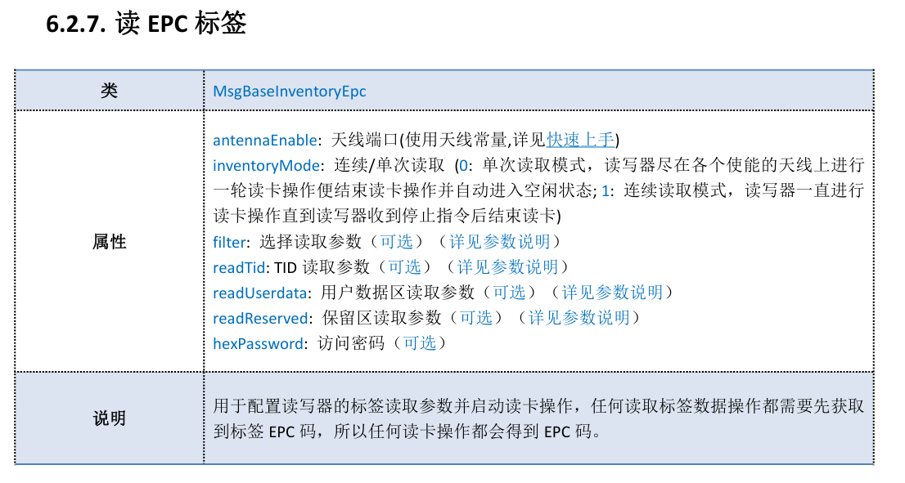

# RFIDReader - 需求分析文档

> 版本: 0.1
> 日期: 2025-06-23

---

## 1. 项目概述 (Project Overview)

### 1.1 项目背景
* **项目目的:** 对RFID Reader的API进行封装，可以进行多通道RFID的读取，保存和初步预处理，用以进行基于柔性天线的人体动作分析。
* **原理**：在PC上使用Python库，通过rs232连接RFID Reader硬件，之后，上位机向读写器发送指令配置读取的基本参数。发送命令让读卡器的对应天线进入读卡状态。在相应的tag进入一定范围内时，会触发读卡器通过事件的形式上报给上位机，上报完成之后通过回调函数触发对应逻辑。结束盘点时，上位机发送停止指令，使读卡器退出读卡状态并返回空闲。最后用close()断开连接，释放资源。

---

## 2. 项目范围 (Scope)

### 2.1 核心功能 (In Scope)
_列出这个项目**必须包含**的核心功能点。_
* [x] 从RS232 COM串口初始化RFID读取硬件。我的电脑上使用的是COM6，baud 115200，但是实际上应该写在简单的配置文件中。

* [ ] 读取RFID。由于存在数据缺失，所以需要用一些处理技巧。

  * [ ] 分帧读取，初步定为100ms，使用帧内RSSI中值代表帧RSSI
  * [ ] 帧信息包含帧读数次数
  * [ ] 帧信息包含帧内RSSI最大值
  * [ ] 如果帧内信息缺失，使用0进行空值填充/可以配置不同的策略

* [x] RFID的读取频率应该尽可能高。开发文档中没有显式写明上报频次，这里需要调试，或者直接按照“尽力而为”逻辑。

  * [x] 利用EpcConfiguration进行配置和查询

* [ ] 用session的形式存储数据，可以手动给session添加“动作类型”这个tag。

* [x] 由于Epc不直观，需要做RFID序号绑定。例如，将epc文件放置在读数器前面获取Epc，绑定对应标签为Tag 1。要有最简单的配置管理功能。

* [x] 互动式CLI

  

### 2.2 范围之外 (Out of Scope)
_明确列出本次迭代**不做**的功能，以防止项目范围无限扩大。_
* [x] 不做的功能一：除了6c epc之外任何类型的读数功能（GB，6B等）。
* [ ] 不做的功能二：totalcount等等冗余数据类型的读数。
* [x] 不做的功能三：任何写标签功能
* [x] 不做的功能四：GUI

---

## 3. 功能需求 (Functional Requirements)

* **FR-1 (Reader配置):** 配置端口和波特率等读取器信息，确保可以正常连接硬件
* **FR-2 (验证读取功能):** 配置好的读取器应该可以实时读取单个或者多个标签的epc和RSSI。
* **FR-3 (对应ID绑定功能):** 可以手动给对应的epc赋id，方便后续读取。
* **FR-4 (采集数据):** 用户应能手动开始一个session。session期间，读取器对rfid进行读数，写入h5文件。
* **FR-5（滤波器）**：可以配置中值滤波器。

---

## 4. 相关文档 (Relevant Documentation) 

---

## 5. 技术选型 (Technology Stack) 

* 数据存储：使用h5py